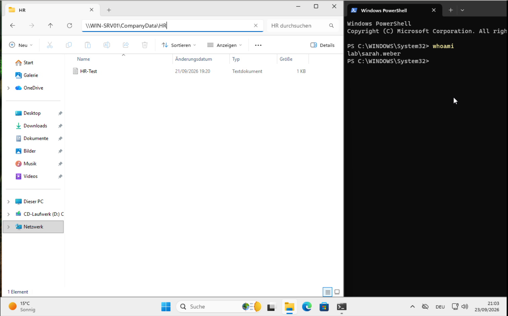
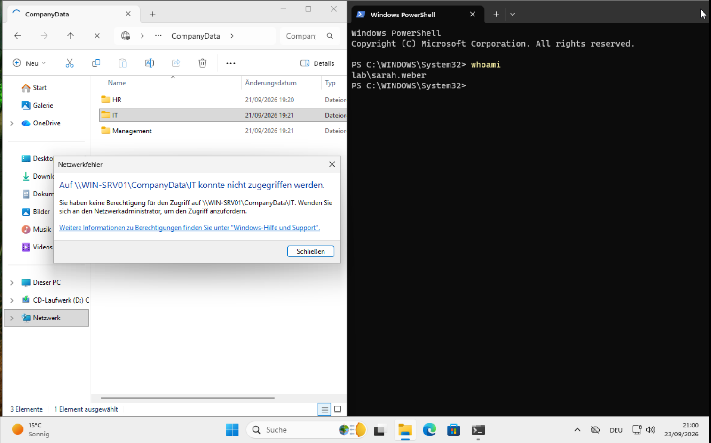
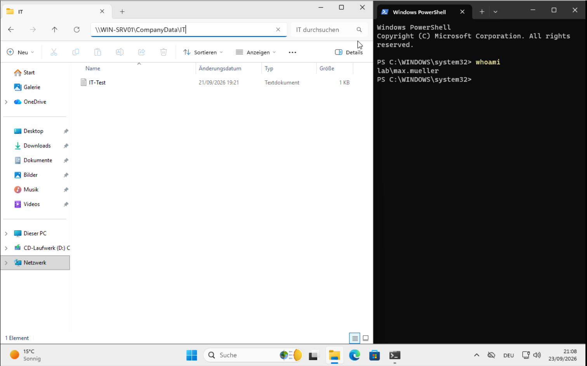
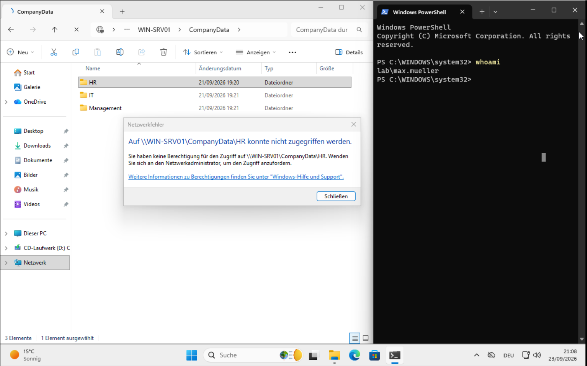
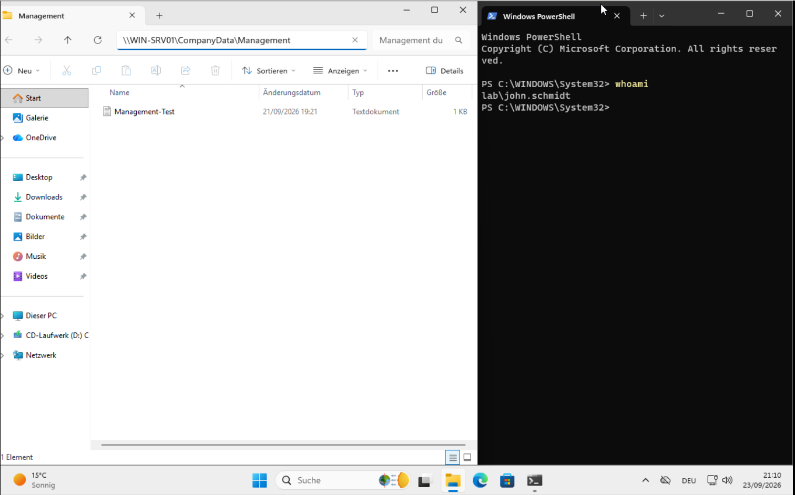
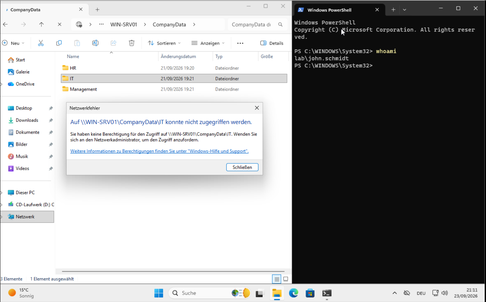

# Department-Based Access Control

## Overview

This section of the lab demonstrates department-based access control using **Active Directory security groups, SMB file sharing, and NTFS permissions**.

The objective is to ensure that employees can access the files required for their department while being prevented from accessing data belonging to other departments.

---

## Lab Environment

| Component | Configuration |
|---|---|
| Server | Windows Server 2025 |
| Client | Windows 11 |
| Active Directory Domain | `lab.local` |
| Domain Controller | `WIN-SRV01` |
| File Server Directory | `C:\CompanyData` |
| File Sharing | SMB |

---

## File Server Structure

A central company data directory was created on the Windows Server.

```text
C:\CompanyData
├── HR
├── IT
└── Management
```

Each department directory contains test documents used to verify the access-control configuration.

---

## Active Directory Security Groups

Access rights were assigned through department-specific security groups rather than directly to individual users.

The following security groups were created:

| Security Group | Purpose |
|---|---|
| `HR-Users` | Access to HR data |
| `IT-Users` | Access to IT data |
| `Management` | Access to Management data |

The users were assigned to their corresponding groups:

| User | Department | Security Group |
|---|---|---|
| Sarah Weber | HR | `HR-Users` |
| Max Mueller | IT | `IT-Users` |
| John Schmidt | Management | `Management` |

Using security groups allows permissions to be managed by role and makes it easier to add or remove users without modifying the underlying folder permissions.

---

## SMB File Sharing

The `C:\CompanyData` directory was shared using **Server Message Block (SMB)**.

The shared directory can be accessed from domain clients using:

```text
\\WIN-SRV01\CompanyData
```

The individual department folders are available through the shared directory:

```text
\\WIN-SRV01\CompanyData\HR
\\WIN-SRV01\CompanyData\IT
\\WIN-SRV01\CompanyData\Management
```

SMB provides the network access mechanism, while NTFS permissions determine which users are authorized to access the individual department folders.

---

## NTFS Permissions

NTFS permissions were configured for each department folder.

| Folder | Security Group | Access |
|---|---|---|
| `HR` | `HR-Users` | Modify |
| `IT` | `IT-Users` | Modify |
| `Management` | `Management` | Modify |

The built-in `Users` group was removed from the department folders to prevent users from receiving broad access through their default group membership.

Administrative and system permissions were retained.

The resulting model is based on the principle of **least privilege**, where users receive only the access required for their role.

---

# Access Control Testing

The configuration was tested from the Windows 11 domain client using the individual Active Directory user accounts.

For each test, the logged-in identity was verified using:

```powershell
whoami
```

Both **authorized** and **unauthorized** access attempts were tested.

---

## 1. Sarah Weber — HR

### Authorized Access

Sarah Weber was authenticated to the `lab.local` domain and successfully accessed the HR directory.

The screenshot shows the HR folder and confirms that the current session belongs to `LAB\sarah.weber`.



**Result:** Access allowed.

### Unauthorized Access

Sarah Weber attempted to access the IT directory.

The access attempt was denied because Sarah does not have the NTFS permissions required for the IT directory.



**Result:** Access denied.

---

## 2. Max Mueller — IT

### Authorized Access

Max Mueller was authenticated to the `lab.local` domain and successfully accessed the IT directory.

The screenshot confirms the logged-in domain account and the successful access to the IT data.



**Result:** Access allowed.

### Unauthorized Access

Max Mueller attempted to access the HR directory.

The access attempt was denied because Max does not have the NTFS permissions required for the HR directory.



**Result:** Access denied.

---

## 3. John Schmidt — Management

### Authorized Access

John Schmidt was authenticated to the `lab.local` domain and successfully accessed the Management directory.

The screenshot confirms the logged-in domain account and the successful access to the Management data.



**Result:** Access allowed.

### Unauthorized Access

John Schmidt attempted to access the IT directory.

The access attempt was denied because John does not have the NTFS permissions required for the IT directory.



**Result:** Access denied.

---

# Access Control Matrix

The final access-control model is shown below.

| User | HR | IT | Management |
|---|---:|---:|---:|
| **Sarah Weber** | ✅ Allowed | ❌ Denied | ❌ Denied |
| **Max Mueller** | ❌ Denied | ✅ Allowed | ❌ Denied |
| **John Schmidt** | ❌ Denied | ❌ Denied | ✅ Allowed |

---

# Verification Results

The access-control implementation was successfully verified using separate domain accounts.

### Sarah Weber

- ✅ HR access
- ❌ IT access
- ❌ Management access

### Max Mueller

- ❌ HR access
- ✅ IT access
- ❌ Management access

### John Schmidt

- ❌ HR access
- ❌ IT access
- ✅ Management access

The tests demonstrate that access is controlled according to the user's department membership.

---

# Security Principles Demonstrated

### Least Privilege

Users are granted only the permissions required for their department.

### Group-Based Access Control

Permissions are assigned to Active Directory security groups instead of individual users.

### Separation of Departmental Data

Users are prevented from accessing information belonging to other departments.

### Authentication and Authorization

Active Directory authenticates the user, while NTFS permissions determine whether the authenticated user is authorized to access the requested resource.

---

# Result

The department-based access-control model was successfully implemented and tested.

The Windows Server provides centralized file storage through SMB, while Active Directory security groups and NTFS permissions enforce department-level authorization.

The final configuration ensures that:

- HR users can access HR data.
- IT users can access IT data.
- Management users can access Management data.
- Users are denied access to the other departments' data.
