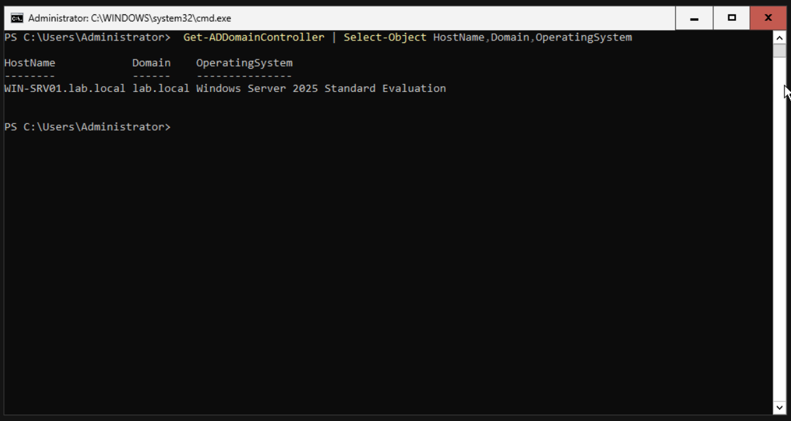
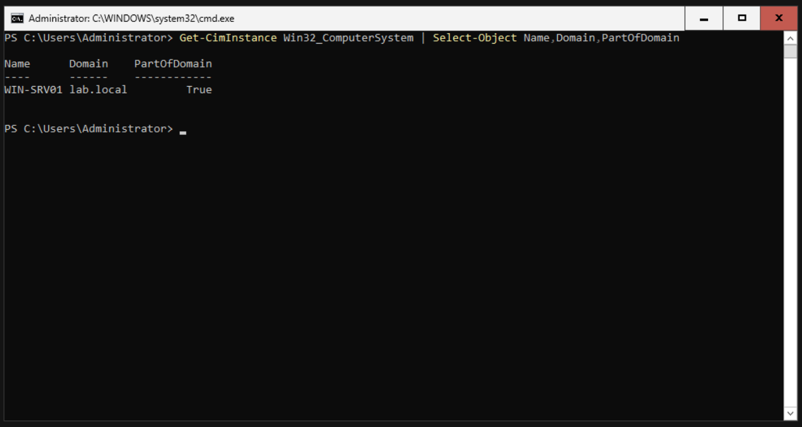

# Active Directory Domain Setup

## Objective

The objective of this stage was to create a Windows Server 2025 Active Directory environment for a simulated small company.

## Lab Environment

- Server OS: Windows Server 2025
- Client OS: Windows 11
- Domain: `lab.local`
- Domain Controller: `WIN-SRV01`
- Host OS: Fedora Linux
- Virtualization: Virtual Machine Manager

## Active Directory Domain

The Windows Server was configured as an Active Directory Domain Controller for the `lab.local` domain.

The configured domain information was verified using PowerShell.

## Domain Controller

The server was verified as a domain controller running Windows Server 2025.

## Domain Client

A Windows 11 virtual machine was joined to the `lab.local` domain.

The domain membership was verified from the Windows 11 client.

## Result

The Active Directory domain was successfully configured and a Windows 11 client was successfully joined to the domain.

The environment now provides centralized authentication and identity management for the lab.
