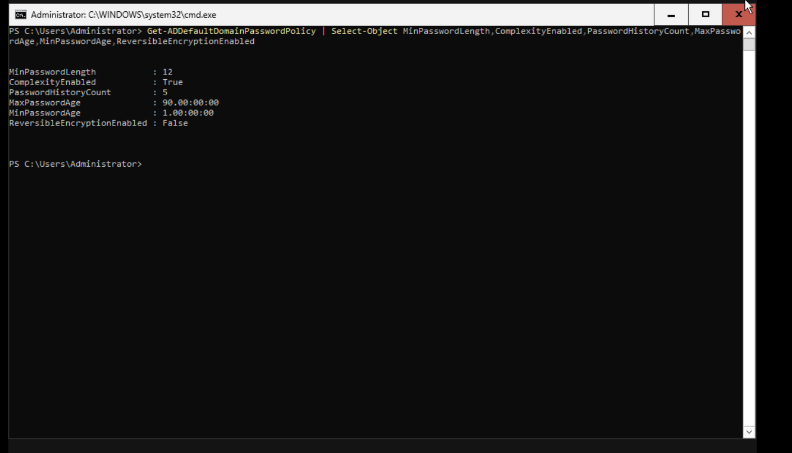
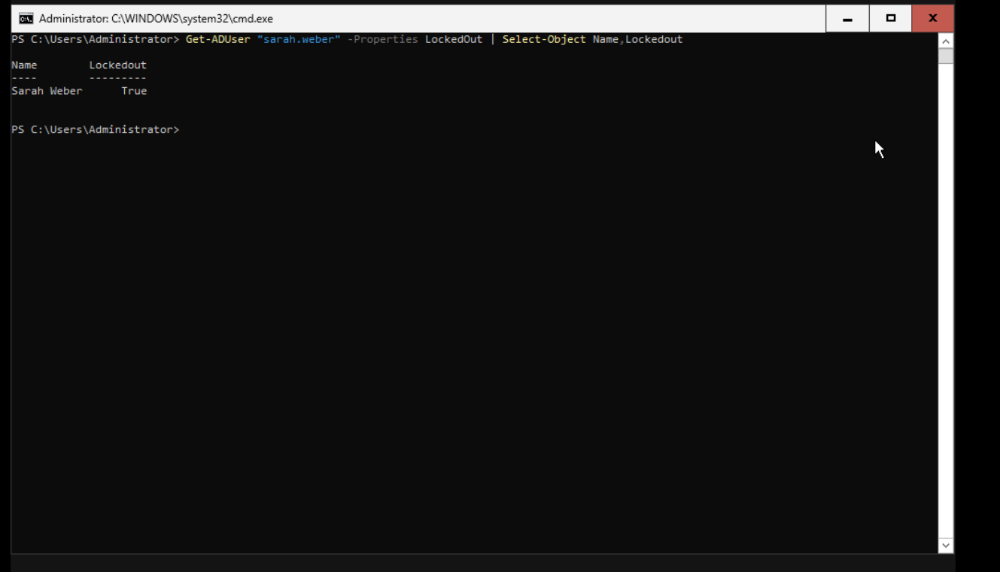

# Password Policy

## Overview

A strong password policy helps protect domain accounts against password guessing, brute-force attacks, and weak credentials.

In this lab, password and account lockout settings are managed centrally through Active Directory. The policy applies to domain user accounts and provides a baseline for authentication security.

The configuration was verified using PowerShell and account lockout testing.

---

## Password Policy Configuration

The domain password policy controls requirements such as:

- Minimum password length
- Password complexity
- Password history
- Maximum password age
- Minimum password age
- Reversible password encryption

The current domain password policy can be viewed with:

```powershell
Get-ADDefaultDomainPasswordPolicy
```

For a more focused view:

```powershell
Get-ADDefaultDomainPasswordPolicy |
Select-Object MinPasswordLength,ComplexityEnabled,PasswordHistoryCount,MaxPasswordAge,MinPasswordAge,ReversibleEncryptionEnabled
```

### Evidence



> The screenshot above shows the configured domain password policy and provides evidence of the authentication requirements enforced by Active Directory.

---

## Account Lockout Policy

Account lockout helps protect accounts from repeated authentication attempts.

The policy can define:

- Account lockout threshold
- Account lockout duration
- Reset account lockout counter after

The configured lockout settings can be viewed with:

```powershell
Get-ADDefaultDomainPasswordPolicy |
Select-Object LockoutThreshold,LockoutDuration,LockoutObservationWindow
```

These settings work together to limit repeated failed authentication attempts.

---

## Account Lockout Testing

The policy was tested using a domain user account.

The test consisted of:

1. Entering an incorrect password repeatedly.
2. Reaching the configured account lockout threshold.
3. Verifying that the account became locked.
4. Unlocking the account through Active Directory.
5. Confirming that the user could authenticate again.

The account can be checked with:

```powershell
Get-ADUser "sarah.weber" -Properties LockedOut |
Select-Object Name,Enabled,LockedOut
```

An administrator can unlock the account with:

```powershell
Unlock-ADAccount -Identity "sarah.weber"
```

### Evidence



> The screenshot documents the account lockout test and demonstrates that the configured policy is enforced.

---

## Security Considerations

The password policy provides several layers of protection:

| Control | Security purpose |
|---|---|
| Minimum password length | Makes password guessing more difficult |
| Password complexity | Reduces the use of simple passwords |
| Password history | Prevents immediate reuse of previous passwords |
| Password expiration | Limits the lifetime of credentials when configured |
| Account lockout | Restricts repeated failed authentication attempts |
| Centralized policy | Applies authentication requirements consistently across the domain |

Password policy is only one part of account security. In a production environment, it should be combined with measures such as MFA, least privilege, secure administration, monitoring, and protection against phishing.

---

## PowerShell Administration

The following commands can be used to inspect the domain password policy:

```powershell
# Display the complete policy
Get-ADDefaultDomainPasswordPolicy

# Display password-related settings
Get-ADDefaultDomainPasswordPolicy |
Select-Object MinPasswordLength,ComplexityEnabled,PasswordHistoryCount,MaxPasswordAge,MinPasswordAge

# Display account lockout settings
Get-ADDefaultDomainPasswordPolicy |
Select-Object LockoutThreshold,LockoutDuration,LockoutObservationWindow
```

PowerShell makes it possible to inspect the configuration without relying exclusively on the graphical Group Policy interface.

---

## Evidence Summary

| Evidence | Purpose |
|---|---|
| `password-policy.png` | Shows the configured domain password policy |
| `account-lockout.png` | Shows the account lockout test |

---

## Result

The Active Directory password and account lockout policies were configured and verified.

The lab demonstrates how centralized password requirements and account lockout controls can be used to strengthen domain authentication and reduce the risk associated with weak or repeatedly guessed credentials.
