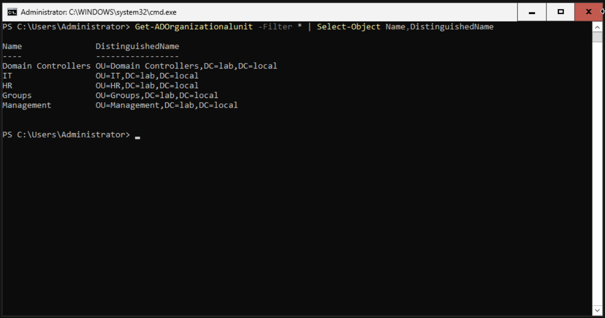
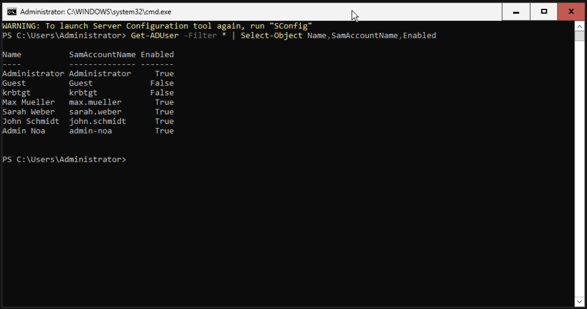
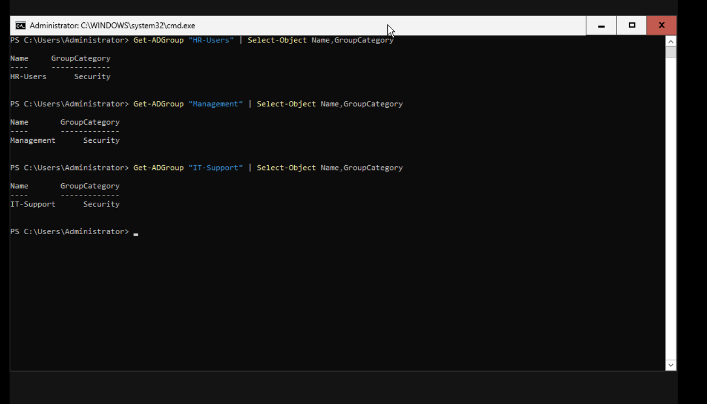
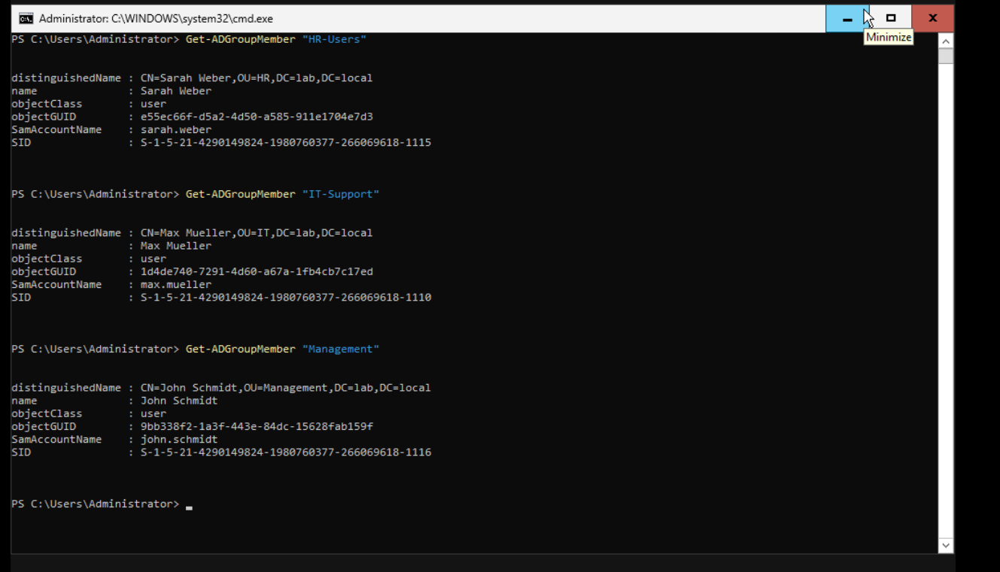

# Active Directory Users and Groups

## Overview

This section documents the user and group structure created in the `lab.local` Active Directory environment.

The lab uses **Organizational Units (OUs)** to organize users and **security groups** to manage department-based access.

The three departments represented are:

- Human Resources
- IT
- Management

---

## Organizational Units

Separate Organizational Units were created to organize the Active Directory environment by department.

The structure includes:

```text
lab.local
├── HR
├── IT
├── Management
└── Groups
```

The Organizational Units were verified using PowerShell:

```powershell
Get-ADOrganizationalUnit -Filter * |
Select-Object Name,DistinguishedName
```



**Result:** The required departmental OUs are present in the Active Directory domain.

---

## Domain User Accounts

Three domain user accounts were created to represent employees from different departments:

| User | Department |
|---|---|
| Sarah Weber | HR |
| Max Mueller | IT |
| John Schmidt | Management |

The accounts were verified using PowerShell:

```powershell
Get-ADUser -Filter * |
Select-Object Name,SamAccountName,Enabled
```



**Result:** The employee accounts are present as Active Directory user objects.

---

## Security Groups

Department-specific security groups were created to manage access to company resources.

The groups used in the lab are:

| Security Group | Department |
|---|---|
| `HR-Users` | HR |
| `IT-Support` | IT |
| `Management` | Management |

The groups were verified using PowerShell:

```powershell
Get-ADGroup "HR-Users" | Select Name,GroupCategory
Get-ADGroup "IT-Support" | Select Name,GroupCategory
Get-ADGroup "Management" | Select Name,GroupCategory
```

The output confirms that the department groups are configured as **Security** groups.



**Result:** Each department has a dedicated security group that can be used when assigning resource permissions.

---

## Group Membership

Each user was assigned to the security group corresponding to their department.

### HR

**Sarah Weber → `HR-Users`**

```powershell
Get-ADGroupMember "HR-Users"
```

### IT

**Max Mueller → `IT-Support`**

```powershell
Get-ADGroupMember "IT-Support"
```

### Management

**John Schmidt → `Management`**

```powershell
Get-ADGroupMember "Management"
```

The group memberships were verified using Active Directory PowerShell.



**Result:** Each employee is a member of the security group corresponding to their department.

---

## Group-Based Access Management

The users are not given department permissions individually. Instead, permissions can be assigned to the security groups.

The resulting structure is:

```text
Sarah Weber
     │
     ▼
 HR-Users
     │
     ▼
   HR data


Max Mueller
     │
     ▼
 IT-Support
     │
     ▼
   IT data


John Schmidt
     │
     ▼
 Management
     │
     ▼
Management data
```

This approach makes access management easier to maintain.

For example, if another employee joins the HR department, the administrator can add the new account to `HR-Users` instead of configuring the HR folder permissions for the individual account.

---

## PowerShell Administration

The Active Directory PowerShell module was used to create and verify the directory structure.

Examples of commands used in the lab include:

```powershell
Get-ADUser -Filter *
```

Lists domain user accounts.

```powershell
Get-ADGroup -Filter *
```

Lists Active Directory groups.

```powershell
Get-ADGroupMember "HR-Users"
```

Displays the members of a specific security group.

```powershell
Get-ADOrganizationalUnit -Filter *
```

Lists the Organizational Units in the domain.

Using PowerShell provides a consistent way to inspect and administer Active Directory and can later be extended to automate repetitive administrative tasks.

---

## Evidence Summary

The following screenshots document the completed configuration:

| Screenshot | Evidence |
|---|---|
| `ous.png` | Active Directory Organizational Units |
| `users-all.png` | Domain user accounts |
| `security-groups.png` | Department security groups |
| `group-membership.png` | User-to-group membership |

Together, these screenshots demonstrate the relationship between the organizational structure, user accounts, security groups, and group membership.

---

## Result

The Active Directory user and group structure was successfully configured.

Each employee has a dedicated domain account and is assigned to the security group representing their department. The groups can then be used to control access to departmental resources through NTFS permissions.

This creates the foundation for the department-based access-control configuration documented in [Access Control](access-control.md).
